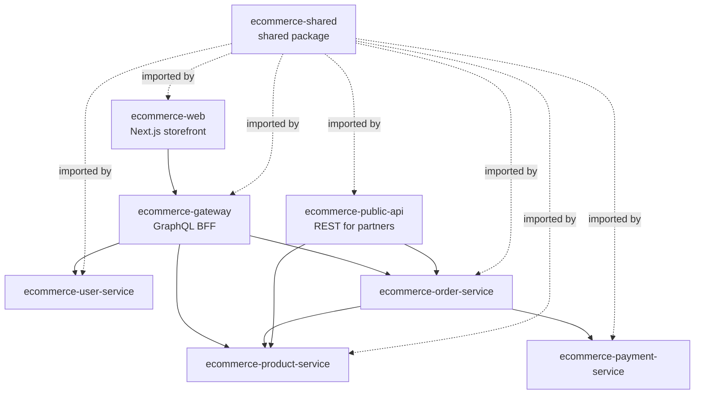
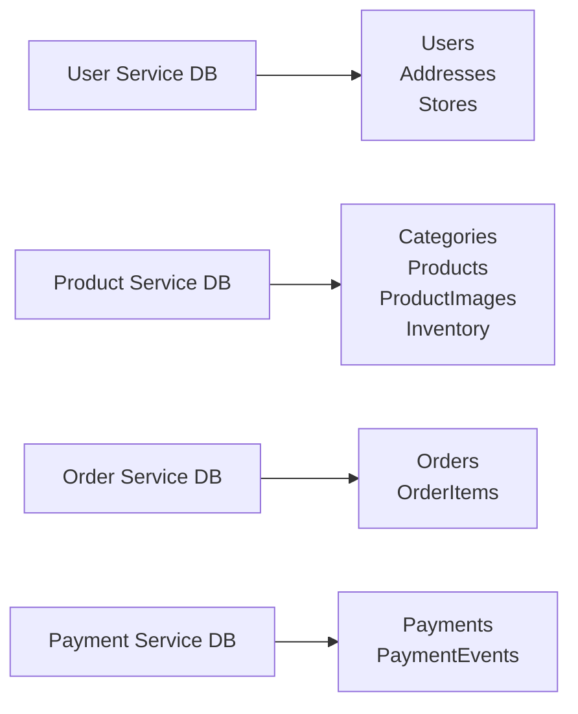
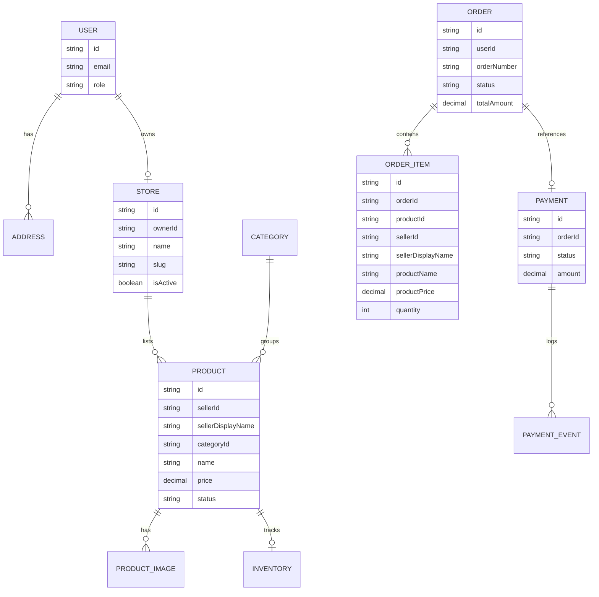
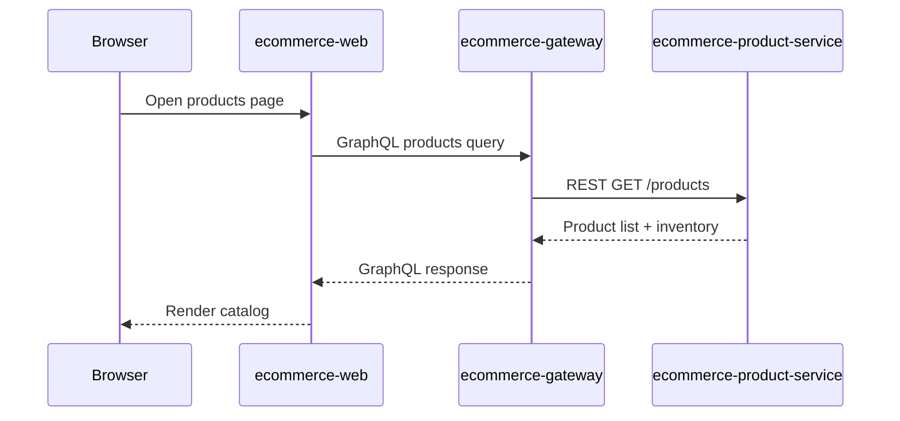
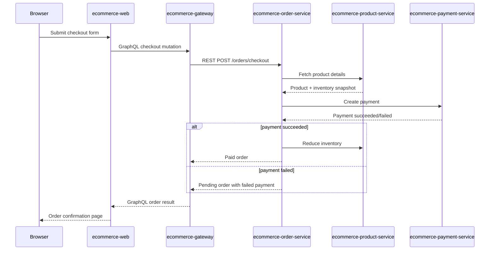
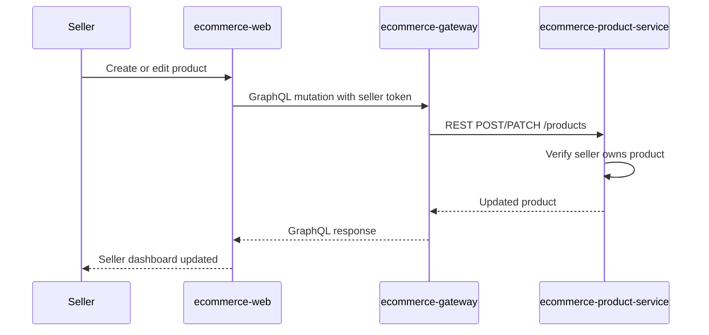
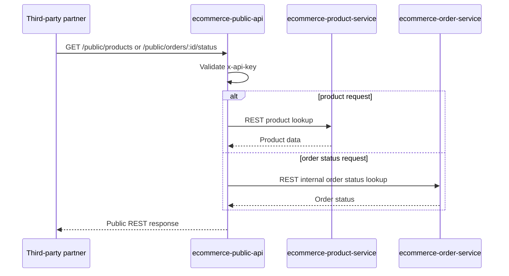
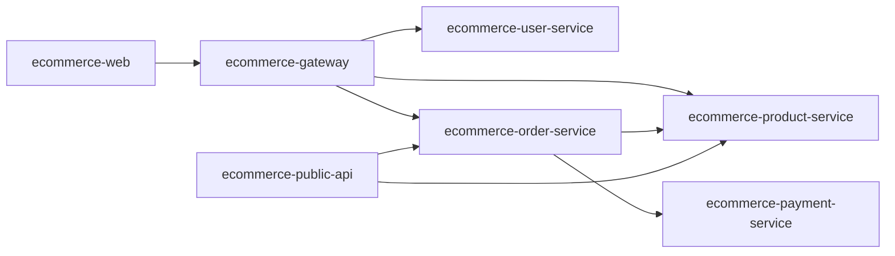

# .github# E-Commerce Marketplace Platform

Production-style, web-first marketplace platform built as a small service-oriented system. The frontend talks only to a GraphQL gateway, internal services communicate over REST, and the codebase is structured so internal REST clients can later be replaced with gRPC-style clients.

This platform now supports three user types:

- `CUSTOMER`
- `SELLER`
- `ADMIN`

## Quick start

If you want the fastest path to running the whole marketplace locally:

1. Build `ecommerce-shared`
2. Create `.env` files from each repo's example file
3. Run Prisma generate, migrate, and seed for:
   - `ecommerce-user-service`
   - `ecommerce-product-service`
   - `ecommerce-payment-service`
   - `ecommerce-order-service`
4. Start services in this order:
   - `ecommerce-user-service`
   - `ecommerce-product-service`
   - `ecommerce-payment-service`
   - `ecommerce-order-service`
   - `ecommerce-gateway`
   - `ecommerce-public-api`
   - `ecommerce-web`
5. Open `http://localhost:3000`
6. Test with:
   - customer: `customer@example.com` / `Customer123!`
   - seller: `seller@example.com` / `Seller123!`
   - admin: `admin@example.com` / `Admin123!`

## Repositories

- `ecommerce-shared` - shared enums, interfaces, constants, helpers
- `ecommerce-web` - Next.js storefront, seller workspace, admin UI
- `ecommerce-gateway` - GraphQL backend-for-frontend
- `ecommerce-user-service` - auth, users, addresses, seller storefronts
- `ecommerce-product-service` - products, categories, inventory, uploads
- `ecommerce-order-service` - checkout, orders, seller order visibility
- `ecommerce-payment-service` - payment simulation and refunds
- `ecommerce-public-api` - third-party REST API with API key auth

## Architecture

```text
Browser
  -> ecommerce-web (Next.js)
  -> ecommerce-gateway (GraphQL BFF)
  -> internal REST services
     -> ecommerce-user-service
     -> ecommerce-product-service
     -> ecommerce-order-service
     -> ecommerce-payment-service

Third-party partner
  -> ecommerce-public-api (REST + API key)
  -> internal REST services

Shared package
  -> ecommerce-shared
```

### High-level diagram



### Data ownership diagram



### ER-style marketplace model



## Core roles

- `CUSTOMER` can browse products, manage cart, checkout, and view personal orders
- `SELLER` can register a storefront, manage seller-owned products, and view seller-specific orders
- `ADMIN` can oversee users, products, and orders across the marketplace

## Role and permission matrix

| Capability | Customer | Seller | Admin |
|---|---|---|---|
| Register/login | Yes | Yes | Seeded/manual |
| Manage personal profile | Yes | Yes | Yes |
| Manage addresses | Yes | Yes | Yes |
| Browse catalog | Yes | Yes | Yes |
| Add to cart and checkout | Yes | No | No |
| View own customer orders | Yes | No | Yes |
| Create seller storefront | No | Yes | Yes |
| Create products | No | Yes, own only | Yes |
| Edit/archive products | No | Yes, own only | Yes |
| Upload product images | No | Yes, own only | Yes |
| View seller order lines | No | Yes, own only | Yes |
| Update marketplace order status | No | No | Yes |
| View all users | No | No | Yes |
| Use public API | Via API key only | Via API key only | Via API key only |

## Service responsibility matrix

| Repository | Primary responsibility | Owns database | Main consumers |
|---|---|---|---|
| `ecommerce-shared` | Shared enums, DTO-friendly interfaces, helpers | No | All repos |
| `ecommerce-web` | Customer, seller, and admin UI | No | Browser users |
| `ecommerce-gateway` | GraphQL BFF, auth forwarding, aggregation | No | `ecommerce-web` |
| `ecommerce-user-service` | Auth, users, addresses, seller stores | Yes | Gateway |
| `ecommerce-product-service` | Categories, seller products, inventory, uploads | Yes | Gateway, order service, public API |
| `ecommerce-order-service` | Checkout, orders, seller order views | Yes | Gateway, public API |
| `ecommerce-payment-service` | Payment simulation and refund events | Yes | Order service |
| `ecommerce-public-api` | Third-party REST endpoints with API key auth | No | External partners |

## Main domain model

- `User` - base identity and auth account
- `Store` - seller storefront owned by a `SELLER`
- `Product` - belongs to a seller/store and category
- `Inventory` - stock for a product
- `Order` - customer checkout record
- `OrderItem` - product snapshot plus seller ownership snapshot
- `Payment` - simulated payment record
- `PaymentEvent` - payment audit trail

## Request flow examples

### Customer browse flow

```text
Web page
  -> GraphQL query to gateway
  -> gateway calls product service
  -> product service returns products/categories/inventory
```



### Customer checkout flow

```text
Web checkout form
  -> GraphQL mutation `checkout`
  -> gateway calls order service
  -> order service fetches product data from product service
  -> order service creates order
  -> order service creates payment through payment service
  -> if payment succeeds, order service reduces inventory in product service
  -> gateway returns final order payload to web
```



### Seller product management flow

```text
Seller UI
  -> GraphQL mutation/query through gateway
  -> gateway validates seller/admin token
  -> gateway calls product service
  -> product service enforces seller ownership on product operations
```



### Public API flow

```text
Partner request with x-api-key
  -> ecommerce-public-api
  -> internal REST call to product service or order service
  -> response returned to partner
```



## Repository interaction map



## Marketplace behavior

- Sellers register through `registerSeller`
- Seller registration creates both a `User` with role `SELLER` and a `Store`
- Products are seller-owned via `sellerId` and `sellerDisplayName`
- Orders store seller ownership per item so seller views can show only the relevant lines
- Customers still experience a unified storefront and checkout

## Local setup

## 1. Install dependencies

Run this inside each repository:

```bash
npm install
```

Recommended order:

1. `ecommerce-shared`
2. `ecommerce-user-service`
3. `ecommerce-product-service`
4. `ecommerce-payment-service`
5. `ecommerce-order-service`
6. `ecommerce-gateway`
7. `ecommerce-public-api`
8. `ecommerce-web`

## 2. Create env files

Copy each repo's `.env.example` to its runtime file:

- backend services and gateway/public API: `.env`
- Next.js app: `.env.local`

## 3. Build shared package

```bash
cd ecommerce-shared
npm run build
```

## 4. Run Prisma generate and migrations

Only the services with databases need Prisma commands.

### User service

```bash
cd ecommerce-user-service
npm run prisma:generate
npm run prisma:migrate -- --name init
npm run prisma:seed
```

### Product service

```bash
cd ecommerce-product-service
npm run prisma:generate
npm run prisma:migrate -- --name init
npm run prisma:seed
```

### Payment service

```bash
cd ecommerce-payment-service
npm run prisma:generate
npm run prisma:migrate -- --name init
npm run prisma:seed
```

### Order service

```bash
cd ecommerce-order-service
npm run prisma:generate
npm run prisma:migrate -- --name init
npm run prisma:seed
```

## 5. Start services

Start them in this order:

1. `ecommerce-user-service`
2. `ecommerce-product-service`
3. `ecommerce-payment-service`
4. `ecommerce-order-service`
5. `ecommerce-gateway`
6. `ecommerce-public-api`
7. `ecommerce-web`

For each service/UI:

```bash
npm run start:dev
```

For the web app:

```bash
npm run dev
```

## Exact run commands

Open a separate terminal for each repository.

### 1. Shared package

This package is not a server. Build it once before starting the apps and services:

```bash
cd ecommerce-shared
npm install
npm run build
```

### 2. User service

```bash
cd ecommerce-user-service
npm install
npm run prisma:generate
npm run prisma:migrate -- --name init
npm run prisma:seed
npm run start:dev
```

### 3. Product service

```bash
cd ecommerce-product-service
npm install
npm run prisma:generate
npm run prisma:migrate -- --name init
npm run prisma:seed
npm run start:dev
```

### 4. Payment service

```bash
cd ecommerce-payment-service
npm install
npm run prisma:generate
npm run prisma:migrate -- --name init
npm run prisma:seed
npm run start:dev
```

### 5. Order service

```bash
cd ecommerce-order-service
npm install
npm run prisma:generate
npm run prisma:migrate -- --name init
npm run prisma:seed
npm run start:dev
```

### 6. GraphQL gateway

```bash
cd ecommerce-gateway
npm install
npm run start:dev
```

### 7. Public API

```bash
cd ecommerce-public-api
npm install
npm run start:dev
```

### 8. Web app

```bash
cd ecommerce-web
npm install
npm run dev
```

## Production-style run commands

If you want to run built apps instead of watch mode:

### Build

```bash
cd ecommerce-shared && npm run build
cd ../ecommerce-user-service && npm run build
cd ../ecommerce-product-service && npm run build
cd ../ecommerce-payment-service && npm run build
cd ../ecommerce-order-service && npm run build
cd ../ecommerce-gateway && npm run build
cd ../ecommerce-public-api && npm run build
cd ../ecommerce-web && npm run build
```

### Start built services

```bash
cd ecommerce-user-service && npm run start:prod
cd ecommerce-product-service && npm run start:prod
cd ecommerce-payment-service && npm run start:prod
cd ecommerce-order-service && npm run start:prod
cd ecommerce-gateway && npm run start:prod
cd ecommerce-public-api && npm run start:prod
cd ecommerce-web && npm run start
```

## Local URLs

- Web: `http://localhost:3000`
- GraphQL gateway: `http://localhost:4000/graphql`
- User service: `http://localhost:4001`
- Product service: `http://localhost:4002`
- Payment service: `http://localhost:4004`
- Order service: `http://localhost:4005`
- Public API: `http://localhost:4006`
- Public API docs: `http://localhost:4006/docs`

## Demo accounts

- Admin: `admin@example.com` / `Admin123!`
- Customer: `customer@example.com` / `Customer123!`
- Seller: `seller@example.com` / `Seller123!`

## Demo payment card

- Success: `4242 4242 4242 4242`
- Any other card number fails

## How auth works

- Login and registration happen through the GraphQL gateway
- The gateway forwards auth requests to the user service
- The user service issues JWT access tokens
- The web app stores the token in local storage
- The gateway validates JWTs before forwarding protected seller/admin/customer actions

## Seller workflows

### Seller registration

- Web page: `/register/seller`
- GraphQL mutation: `registerSeller`
- User service creates seller user + store

### Seller catalog management

- Seller UI: `/seller/products`
- Seller can create/edit/archive only their own products
- Product service enforces ownership by `sellerId`

### Seller order visibility

- Seller UI: `/seller/orders`
- Seller sees orders containing their items
- Seller detail responses are filtered to seller-owned order lines

## Admin workflows

- Admin dashboard: `/admin`
- Admin can manage marketplace products and orders
- Admin can view across all sellers

## Public API

Protected by `x-api-key`.

Endpoints:

- `GET /public/products`
- `GET /public/products/:id`
- `GET /public/orders/:id/status`

## Deployment model

- `ecommerce-web` -> Vercel
- backend services -> Render Web Services
- PostgreSQL databases -> Render PostgreSQL
- no Docker
- no Redis

## Where each repository deploys

| Repository | Deploy target | Runtime role |
|---|---|---|
| `ecommerce-shared` | Not deployed directly | Shared local/package dependency used during builds |
| `ecommerce-web` | Vercel | Customer, seller, and admin frontend |
| `ecommerce-gateway` | Render Web Service | GraphQL backend-for-frontend |
| `ecommerce-user-service` | Render Web Service + Render PostgreSQL | Auth, users, addresses, stores |
| `ecommerce-product-service` | Render Web Service + Render PostgreSQL | Products, categories, inventory, uploads |
| `ecommerce-order-service` | Render Web Service + Render PostgreSQL | Checkout and orders |
| `ecommerce-payment-service` | Render Web Service + Render PostgreSQL | Payment simulation and payment history |
| `ecommerce-public-api` | Render Web Service | Third-party REST API |

## Deployment dependency order

Deploy in this order so service URLs can be wired correctly:

1. `ecommerce-user-service`
2. `ecommerce-product-service`
3. `ecommerce-payment-service`
4. `ecommerce-order-service`
5. `ecommerce-gateway`
6. `ecommerce-public-api`
7. `ecommerce-web`

After each backend service is deployed on Render, copy its public URL into the dependent service's environment variables.

## Environment variable mapping by deployment

Use this table when wiring deployed services together.

| Repository | Variable | Example deployed value | Notes |
|---|---|---|---|
| `ecommerce-web` | `NEXT_PUBLIC_GRAPHQL_URL` | `https://ecommerce-gateway.onrender.com/graphql` | Points to deployed gateway GraphQL endpoint |
| `ecommerce-gateway` | `USER_SERVICE_URL` | `https://ecommerce-user-service.onrender.com` | Base URL only, no trailing slash needed |
| `ecommerce-gateway` | `PRODUCT_SERVICE_URL` | `https://ecommerce-product-service.onrender.com` | Base URL for product service |
| `ecommerce-gateway` | `ORDER_SERVICE_URL` | `https://ecommerce-order-service.onrender.com` | Base URL for order service |
| `ecommerce-gateway` | `JWT_SECRET` | same secret as user/order/product/payment services | Must match token issuer/validators |
| `ecommerce-user-service` | `DATABASE_URL` | Render PostgreSQL connection string | Comes from its own Render database |
| `ecommerce-user-service` | `JWT_SECRET` | shared production JWT secret | Must match gateway and JWT-aware services |
| `ecommerce-user-service` | `CORS_ORIGIN` | `https://your-web-app.vercel.app` | Allow frontend origin |
| `ecommerce-product-service` | `DATABASE_URL` | Render PostgreSQL connection string | Comes from its own Render database |
| `ecommerce-product-service` | `JWT_SECRET` | shared production JWT secret | Needed for admin/seller auth validation |
| `ecommerce-product-service` | `CLOUDINARY_CLOUD_NAME` | your Cloudinary cloud name | Required for uploads |
| `ecommerce-product-service` | `CLOUDINARY_API_KEY` | your Cloudinary API key | Required for uploads |
| `ecommerce-product-service` | `CLOUDINARY_API_SECRET` | your Cloudinary API secret | Required for uploads |
| `ecommerce-product-service` | `CORS_ORIGIN` | `https://your-web-app.vercel.app` | Allow frontend origin |
| `ecommerce-payment-service` | `DATABASE_URL` | Render PostgreSQL connection string | Comes from its own Render database |
| `ecommerce-payment-service` | `JWT_SECRET` | shared production JWT secret | Needed for protected payment reads/admin ops |
| `ecommerce-payment-service` | `CORS_ORIGIN` | `https://your-web-app.vercel.app` | Allow frontend origin |
| `ecommerce-order-service` | `DATABASE_URL` | Render PostgreSQL connection string | Comes from its own Render database |
| `ecommerce-order-service` | `JWT_SECRET` | shared production JWT secret | Needed for customer/seller/admin auth validation |
| `ecommerce-order-service` | `PRODUCT_SERVICE_URL` | `https://ecommerce-product-service.onrender.com` | Base URL for product lookups/inventory updates |
| `ecommerce-order-service` | `PAYMENT_SERVICE_URL` | `https://ecommerce-payment-service.onrender.com` | Base URL for payment creation/lookups |
| `ecommerce-order-service` | `CORS_ORIGIN` | `https://your-web-app.vercel.app` | Allow frontend origin |
| `ecommerce-public-api` | `PUBLIC_API_KEY` | generated long random string | Shared only with partners |
| `ecommerce-public-api` | `PRODUCT_SERVICE_URL` | `https://ecommerce-product-service.onrender.com` | Base URL for public product reads |
| `ecommerce-public-api` | `ORDER_SERVICE_URL` | `https://ecommerce-order-service.onrender.com` | Base URL for public order status reads |
| `ecommerce-public-api` | `CORS_ORIGIN` | `*` or partner domain | Public API can stay open if desired |

## Shared secret rule

These repositories should use the same production `JWT_SECRET`:

- `ecommerce-gateway`
- `ecommerce-user-service`
- `ecommerce-product-service`
- `ecommerce-order-service`
- `ecommerce-payment-service`

This is required because the user service issues JWTs and the other services validate them.

## Production env templates

Copy these as starting points when configuring deployed services.

### `ecommerce-web` on Vercel

```env
NEXT_PUBLIC_GRAPHQL_URL=https://ecommerce-gateway.onrender.com/graphql
```

### `ecommerce-gateway` on Render

```env
PORT=4000
NODE_ENV=production
JWT_SECRET=replace-with-shared-production-jwt-secret
USER_SERVICE_URL=https://ecommerce-user-service.onrender.com
PRODUCT_SERVICE_URL=https://ecommerce-product-service.onrender.com
ORDER_SERVICE_URL=https://ecommerce-order-service.onrender.com
CORS_ORIGIN=https://your-web-app.vercel.app
```

### `ecommerce-user-service` on Render

```env
PORT=4001
NODE_ENV=production
DATABASE_URL=postgresql://...
JWT_SECRET=replace-with-shared-production-jwt-secret
JWT_EXPIRES_IN=1d
BCRYPT_SALT_ROUNDS=10
CORS_ORIGIN=https://your-web-app.vercel.app
```

### `ecommerce-product-service` on Render

```env
PORT=4002
NODE_ENV=production
DATABASE_URL=postgresql://...
JWT_SECRET=replace-with-shared-production-jwt-secret
CLOUDINARY_CLOUD_NAME=your-cloud-name
CLOUDINARY_API_KEY=your-api-key
CLOUDINARY_API_SECRET=your-api-secret
CORS_ORIGIN=https://your-web-app.vercel.app
```

### `ecommerce-payment-service` on Render

```env
PORT=4004
NODE_ENV=production
DATABASE_URL=postgresql://...
JWT_SECRET=replace-with-shared-production-jwt-secret
CORS_ORIGIN=https://your-web-app.vercel.app
```

### `ecommerce-order-service` on Render

```env
PORT=4005
NODE_ENV=production
DATABASE_URL=postgresql://...
JWT_SECRET=replace-with-shared-production-jwt-secret
PRODUCT_SERVICE_URL=https://ecommerce-product-service.onrender.com
PAYMENT_SERVICE_URL=https://ecommerce-payment-service.onrender.com
CORS_ORIGIN=https://your-web-app.vercel.app
```

### `ecommerce-public-api` on Render

```env
PORT=4006
NODE_ENV=production
PUBLIC_API_KEY=replace-with-long-random-api-key
PRODUCT_SERVICE_URL=https://ecommerce-product-service.onrender.com
ORDER_SERVICE_URL=https://ecommerce-order-service.onrender.com
CORS_ORIGIN=*
```

## Post-deploy checklist

1. Deploy DB-backed services and provision their Render PostgreSQL databases
2. Run Prisma deploy on `ecommerce-user-service`, `ecommerce-product-service`, `ecommerce-payment-service`, and `ecommerce-order-service`
3. Seed at least `ecommerce-user-service` and `ecommerce-product-service` if you want demo data
4. Set service URLs in `ecommerce-order-service`, `ecommerce-gateway`, and `ecommerce-public-api`
5. Set `NEXT_PUBLIC_GRAPHQL_URL` in `ecommerce-web`
6. Verify login, seller dashboard, checkout, admin pages, and public API docs

## Render deployment order

1. Provision PostgreSQL instances for DB-backed services
2. Deploy `ecommerce-user-service`
3. Deploy `ecommerce-product-service`
4. Deploy `ecommerce-payment-service`
5. Deploy `ecommerce-order-service`
6. Deploy `ecommerce-gateway`
7. Deploy `ecommerce-public-api`
8. Deploy `ecommerce-web` on Vercel with `NEXT_PUBLIC_GRAPHQL_URL` pointed to the gateway

## Render build and start commands

| Repository | Build command | Start command |
|---|---|---|
| `ecommerce-gateway` | `npm install && npm run build` | `npm run start:prod` |
| `ecommerce-user-service` | `npm install && npm run build` | `npm run prisma:deploy && npm run start:prod` |
| `ecommerce-product-service` | `npm install && npm run build` | `npm run prisma:deploy && npm run start:prod` |
| `ecommerce-order-service` | `npm install && npm run build` | `npm run prisma:deploy && npm run start:prod` |
| `ecommerce-payment-service` | `npm install && npm run build` | `npm run prisma:deploy && npm run start:prod` |
| `ecommerce-public-api` | `npm install && npm run build` | `npm run start:prod` |

For `ecommerce-web` on Vercel:

- Build command: `npm run build`
- Start command: managed by Vercel

## Build verification

These repositories were built successfully in the current workspace:

- `ecommerce-shared`
- `ecommerce-user-service`
- `ecommerce-product-service`
- `ecommerce-payment-service`
- `ecommerce-order-service`
- `ecommerce-gateway`
- `ecommerce-public-api`
- `ecommerce-web`

## Important note on migrations

Because the platform was upgraded from single-merchant to marketplace mode, make sure you run fresh Prisma migrations for:

- `ecommerce-user-service`
- `ecommerce-product-service`
- `ecommerce-order-service`

Then reseed before testing seller flows.

## Recommended first test run

1. Log in as seller and verify `/seller`
2. Create a seller product
3. Log in as customer and add products to cart
4. Checkout with `4242 4242 4242 4242`
5. Verify order in `/orders`
6. Log back in as seller and verify `/seller/orders`
7. Verify admin visibility in `/admin/orders`
